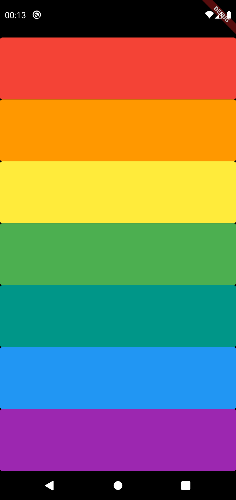

# xylophone

A Flutter project to transform your smartphone into an xylophone.

 

  

 

## Getting Started

A few resources to get you started:

- [Lab: Write your first Flutter app](https://flutter.dev/docs/get-started/codelab)
- [Cookbook: Useful Flutter samples](https://flutter.dev/docs/cookbook)
- [Section 9: Xylophone - Using Flutter and Dart Packages to Speed Up Development](https://github.com/londonappbrewery/Flutter-Course-Resources#section-9-xylophone---using-flutter-and-dart-packages-to-speed-up-development)
